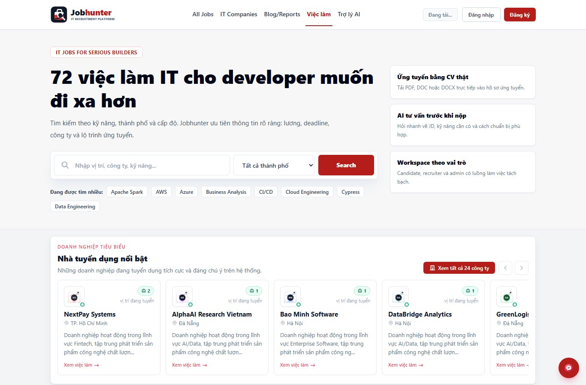
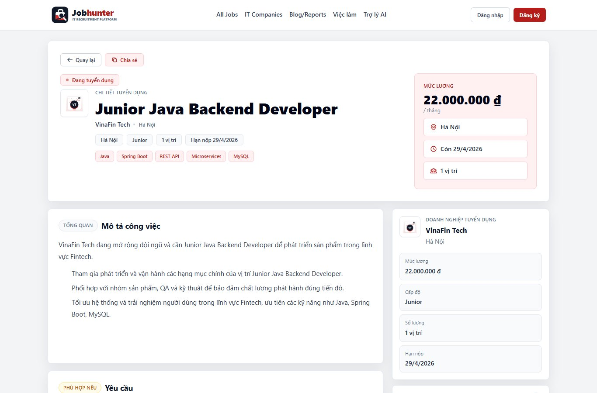
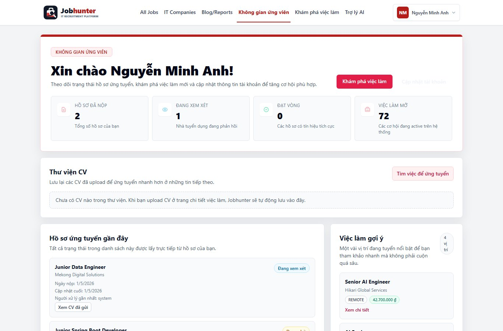
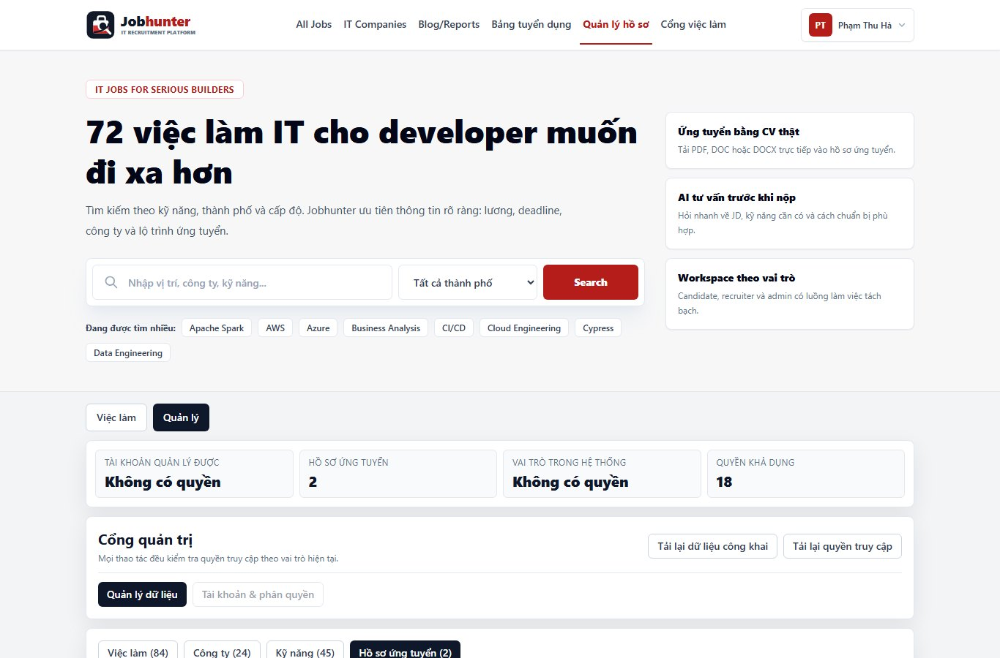
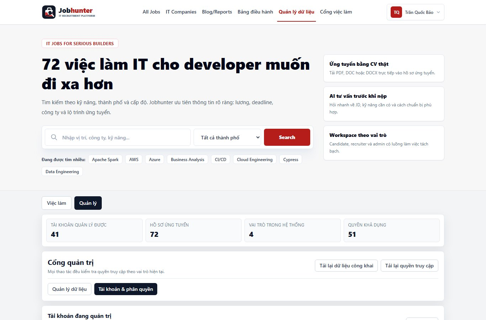
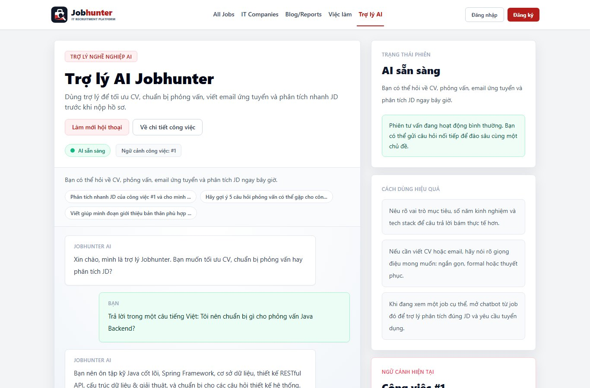

<p align="center">
  
</p>

# Jobhunter

[](https://github.com/JasonTM17/JobHunter_SpringBoot_RestfulAPI_React/actions/workflows/ci.yml)
[](https://github.com/JasonTM17/JobHunter_SpringBoot_RestfulAPI_React/actions/workflows/cd.yml)
[](https://github.com/JasonTM17/JobHunter_SpringBoot_RestfulAPI_React/releases)

Production-ready IT recruitment platform built with Spring Boot, Next.js, MySQL, Docker, RBAC, CI/CD, E2E testing, visual regression, and local production observability.

Jobhunter is designed as a polished portfolio project: it demonstrates product thinking, full-stack delivery, production hardening, release discipline, and practical operations without requiring a public domain.

The visual identity uses a custom Jobhunter logo mark and generated demo-company brand images owned by this repository, so the UI no longer depends on third-party brand assets for the portfolio demo.

## Product Scope

- Public job board with keyword, city, level, skill, salary, sorting, job detail, top employers, content hub, subscriber flow, and professional About content.
- Candidate workspace with account-scoped saved jobs, CV URL/upload apply flow, CV library, application history, and resume status timeline.
- Recruiter workspace with company-scoped pipeline, filters, status updates, notes, and audit history.
- Admin workspace for users, companies, jobs, skills, roles, and permissions.
- Auth flows for login, registration, forgot/reset password, HttpOnly cookie auth, RBAC, and email preferences.

## Engineering Highlights

- Spring Boot 4, Java 21, Spring Security, JPA, Flyway, MySQL 8.4.
- Next.js 16, React 19, TypeScript, TailwindCSS, responsive pages router UI.
- Production guard for unsafe prod settings, unsafe-method client header, MVP rate limiting, rich-text sanitizer, and upload validation.
- Prometheus metrics, Blackbox uptime checks, Alertmanager alerts, Loki logs, Grafana dashboard, OpenTelemetry collector, and frontend client error capture.
- Staging Compose environment, scheduled MySQL backup/restore, Docker Hub images, GitHub Container Registry packages, GitHub Releases, CI and CD.

## Architecture

```text
Browser
  -> Next.js frontend
  -> Spring Boot REST API
  -> MySQL + Flyway

Local production operations
  -> Prometheus + Blackbox Exporter
  -> Alertmanager + local alert webhook
  -> Promtail + Loki + Grafana
  -> OpenTelemetry Collector
  -> MySQL backup sidecar
```

## Product Screenshots

Screenshots below are generated from the local production build with the QA scanner, not static mockups.

| Public job board | Job detail and apply panel |
| --- | --- |
|  |  |

| Candidate workspace | Recruiter pipeline |
| --- | --- |
|  |  |

| Admin users | Gemini AI assistant |
| --- | --- |
|  |  |

## Documentation

- [Product About](docs/ABOUT.md)
- [Release Notes](docs/RELEASE_NOTES.md)
- [Production Runbook](docs/PRODUCTION_RUNBOOK.md)
- [Local Production Operations](docs/LOCAL_PRODUCTION_OPERATIONS.md)
- [E2E and QA Guide](docs/E2E_QA.md)
- [Final Acceptance](docs/FINAL_ACCEPTANCE.md)
- [Visual Assets and Product Screenshots](docs/VISUAL_ASSETS.md)
- [Frontend Guide](frontend/README.md)
- [Backend Guide](backend/README.md)

## Quick Start

Requirements:

- Java 21
- Node.js 22
- Docker Desktop

Run with Docker Compose:

```powershell
Copy-Item .env.example .env
docker compose up --build
```

Local URLs:

- Frontend: `http://localhost:3001`
- Backend: `http://localhost:8080`
- API prefix: `http://localhost:8080/api/v1`
- Health: `http://localhost:8080/actuator/health`
- Swagger, when enabled: `http://localhost:8080/swagger-ui.html`

Run local development:

```powershell
cd backend
.\gradlew.bat bootRun

cd ..\frontend
npm install
npm run dev
```

Frontend dev default: `http://localhost:3010`.

## Local Production Stack

Start the portfolio-grade local production stack:

```powershell
npm run prod:local
```

This starts the app plus monitoring, alerts, log aggregation, OpenTelemetry collection, Grafana dashboards, and scheduled MySQL backups.

Operations URLs:

- Grafana: `http://localhost:3002`
- Prometheus: `http://localhost:9090`
- Alertmanager: `http://localhost:9093`
- Local alert webhook: `http://localhost:9094/health`
- Loki: `http://localhost:3100`
- OpenTelemetry health: `http://localhost:13133`

Run staging before local production changes:

```powershell
Copy-Item .env.staging.example .env.staging
npm run staging:up
```

Staging URLs:

- Frontend: `http://localhost:3101`
- Backend: `http://localhost:8180`
- MySQL host port: `3317`

Back up and restore MySQL:

```powershell
npm run mysql:backup
npm run mysql:restore -- -BackupFile .\backups\mysql\<backup-file>.sql.gz
```

## Container Images

Docker Hub:

```powershell
docker pull nguyenson1710/jobhunter-backend:1.0.5
docker pull nguyenson1710/jobhunter-frontend:1.0.5
```

GitHub Container Registry:

```powershell
docker pull ghcr.io/jasontm17/jobhunter-backend:1.0.5
docker pull ghcr.io/jasontm17/jobhunter-frontend:1.0.5
```

Use versioned tags for controlled demos. Use `latest` only for local smoke and intentionally rolling environments.

## Quality Gates

Backend:

```powershell
cd backend
.\gradlew.bat test
```

Frontend:

```powershell
cd frontend
npm run lint
npm test -- --runInBand
npm run build
npm run test:e2e
npm run test:visual
npm audit --omit=dev --audit-level=high
```

Smoke after backend/frontend are running:

```powershell
npm run smoke:local -- --browser=true
```

Deep local production QA with security header checks, API health, unsafe-method guard, chatbot, desktop/mobile routes, authenticated workspaces, and screenshot capture:

```powershell
npm run qa:local -- --frontend-url=http://localhost:3001 --api-base-url=http://localhost:8080/api/v1 --screenshots
```

Latest verified gate set for `v1.0.5`:

- Backend tests pass.
- Frontend lint, Jest, production build, E2E, visual regression, and production audit pass.
- Local production smoke passes 11/11.
- Local production QA scanner passes 3/3 with screenshots generated under `docs/assets/screenshots`.
- Staging health smoke passes.
- GitHub Actions CI/CD are green.
- Docker Hub and GitHub Packages publish versioned backend/frontend images.

## Production Security

When `SPRING_PROFILES_ACTIVE=prod`, the backend fails fast if unsafe production settings remain enabled: default JWT secret, insecure cookies, password reset dev tokens, seed/bootstrap admin, or Swagger without explicit intent.

Unsafe `POST/PUT/PATCH/DELETE` calls under `/api/**` require:

```http
X-Jobhunter-Client: web
```

The frontend API client sends this automatically.

## Release Process

1. Update release notes and docs.
2. Run backend, frontend, E2E, visual, audit, and smoke gates.
3. Verify staging and local production health.
4. Build and push Docker images.
5. Tag the release and publish GitHub Release notes.
6. Confirm Docker Hub, GitHub Packages, CI, CD, home, job detail, candidate, recruiter, and admin flows.

## License

MIT License.
