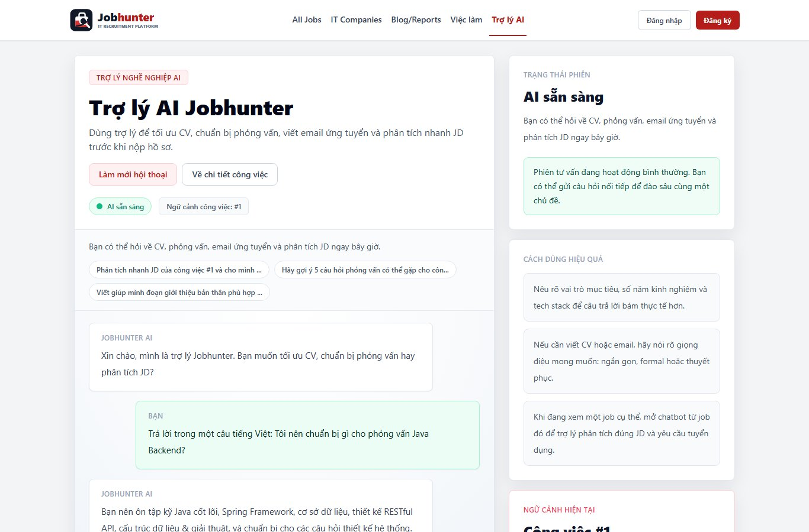

# About Jobhunter

  

## Executive Summary

Jobhunter is a production MVP for an IT recruitment platform. It is built to show a complete product loop: job discovery, candidate applications, recruiter review, admin operations, release automation, and local production observability.

The project is intentionally portfolio-ready. It does not stop at CRUD screens; it includes role-aware workflows, production guardrails, test coverage, release artifacts, container packages, and an operations stack that can run locally without a public domain.

## Product Users

- Candidates search jobs, compare salary and skills, save opportunities, apply with CVs, manage a CV library, and track resume status.
- Recruiters manage applications inside their company scope, filter pipelines, update statuses, and leave audit notes.
- Administrators manage operational data across users, companies, jobs, skills, roles, and permissions.

## Product Capabilities

- Search-first public job board with city, skill, level, salary, sort, pagination, job detail, top employers, content hub, subscriber flow, and About section.
- Candidate workspace with account-scoped saved jobs, CV URL/upload application, CV library, application history, and status timeline.
- Recruiter workspace with resume pipeline, filters, status updates, audit notes, and company-scoped permissions.
- Admin workspace with operational management screens, pagination/filter patterns, destructive-action confirmation, and clear error states.
- Auth and account flows with login, register, forgot/reset password, HttpOnly cookie auth, RBAC, and email preferences.

## Visual Identity

- Custom Jobhunter logo mark combining a job briefcase, search lens, and upward career signal.
- Full logo asset for header/footer and compact mark for favicon/auth surfaces.
- Generated demo-company brand images for every seeded employer, including companies that previously had no image.
- Clean red, white, slate, and sector-accent palette designed for an IT recruitment portfolio rather than copied third-party brand assets.
- Visual asset maintenance and screenshot refresh workflow are documented in [Visual Assets And Product Screenshots](VISUAL_ASSETS.md).

## Engineering Maturity

- Backend: Spring Boot 4, Java 21, Spring Security, JPA, Flyway, MySQL 8.4, Actuator, Prometheus metrics, Micrometer tracing.
- Frontend: Next.js 16, React 19, TypeScript, TailwindCSS, Jest, Testing Library, Playwright E2E, visual regression.
- Security: production startup guard, unsafe-method client header, in-memory MVP rate limiting, allowlist rich-text sanitizer, upload validation, scoped resume access, and conflict-safe delete behavior.
- Delivery: GitHub Actions CI/CD, GitHub Releases, Docker Hub images, GitHub Container Registry packages, smoke tests, audit checks, and versioned release notes.

## Operations Maturity

- Local production stack: Prometheus, Blackbox Exporter, Alertmanager, local alert webhook, Loki, Promtail, Grafana, OpenTelemetry Collector.
- Staging stack: separate Docker Compose override, ports, network, and volumes for release-candidate checks before local production.
- Data protection: scheduled MySQL backups, manual backup script, restore script, Git-ignored backup folder, and restore rehearsal guidance.
- Observability: backend health/metrics/traces, frontend client error reporting, structured JSON error logs, dashboard provisioning, and local alert log output.

## Product Gallery

These images are captured from the local production container stack and refreshed through `npm run qa:local -- --screenshots`.

| Experience | Screenshot |
| --- | --- |
| Public job board with search, dense job cards, top employers, and content hub |  |
| Job detail with salary emphasis, JD content, company context, and apply panel |  |
| Candidate workspace with saved jobs, CV library, application history, and status timeline |  |
| Recruiter resume pipeline with company-scoped workflow and audit notes |  |
| Admin user management for operational control |  |
| Gemini-powered AI assistant with job-context prompts and live chat response |  |

## Portfolio Positioning

Jobhunter is suitable for:

- Full-stack portfolio review.
- Internship or job interview demonstration.
- Local product demo without a public domain.
- Foundation for a real recruitment product after external email, object storage, Redis rate limiting, and hosted observability are added.

## Known Boundaries

- In-memory rate limiting is appropriate for a single-node MVP; use Redis before multi-instance deployment.
- Local observability is intentionally self-hosted through Docker Compose; a hosted deployment should use managed log/trace/alert storage.
- Email flows depend on runtime SMTP configuration.
- More destructive admin operations can be expanded into a broader audit ledger later.
